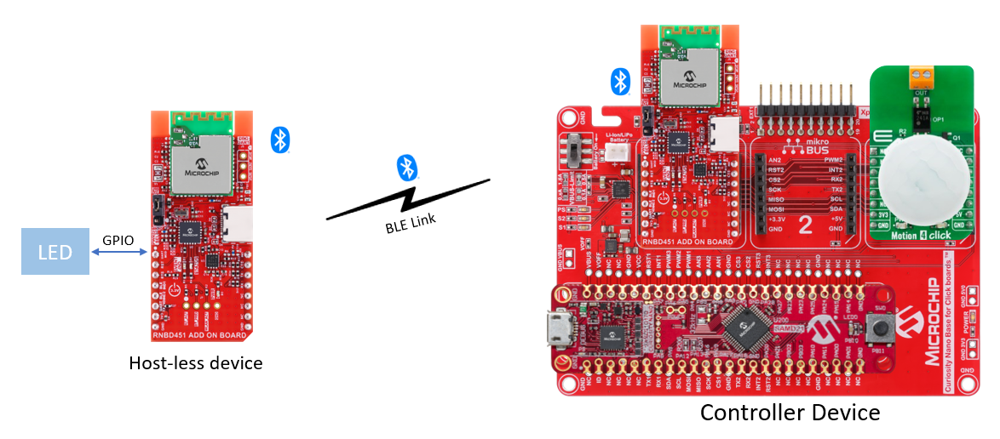
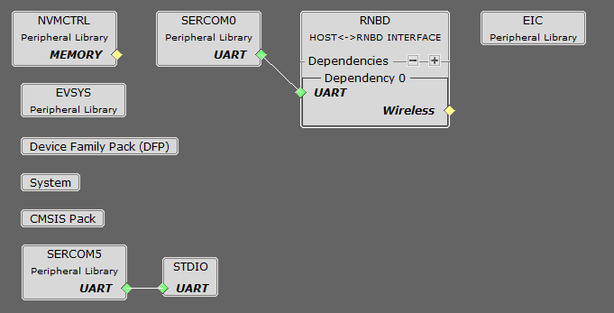
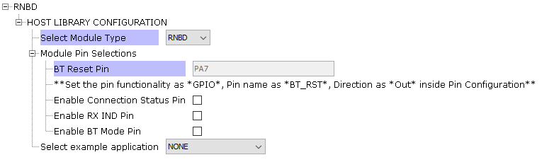
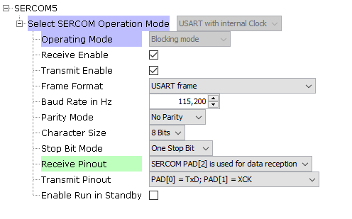
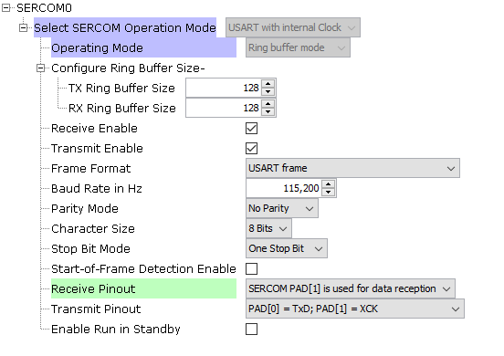
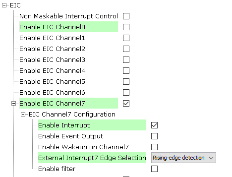
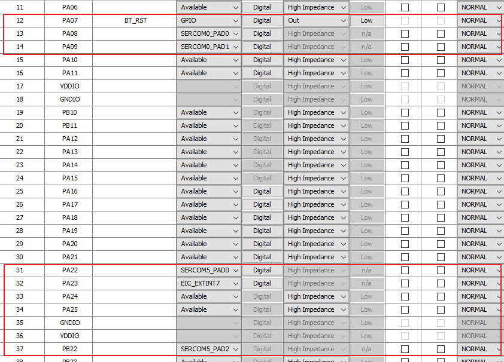

# RNBD451 REMOTE COMMAND MODE

> "IoT Made Easy!" 

Devices: **| RNBD451 | SAMD21 |** 
Features: **| BLE |**

## ⚠ Disclaimer

<b>
THE SOFTWARE ARE PROVIDED "AS IS" AND GIVE A PATH FOR SELF-SUPPORT AND SELF-MAINTENANCE. This repository contains example code intended to help accelerate client product development.  

For additional Microchip repos, see: <a href="https://github.com/Microchip-MPLAB-Harmony" target="_blank">https://github.com/Microchip-MPLAB-Harmony</a>

Checkout the <a href="https://microchipsupport.force.com/s/" target="_blank">Technical support portal</a> to access our knowledge base, community forums or submit support ticket requests.

</b>

## Contents

1. [Introduction](#step1)
1. [Bill of materials](#step2)
1. [Software Setup](#step3)
1. [Hardware Setup](#step4)
1. [Harmony MCC Configuration](#step5)
1. [Board Programming](#step6)
1. [Run the demo](#step7)

## 1. Introduction<a name="step1">

This application demonstrates the RNBD451 remote command feature. This feature allows the control of an RNBD451 module without the use of a host microcontroller remotely from either another RNBD451 module or a mobile application. The remote command feature works by using a special BLE GATT service that emulates a wireless serial connection called transparent UART mode. This combined with a unique command set allows remote functionality of the module. Two RNBD451 modules will be used for implementing the Remote command feature. One will be called the Central device and the other will be Remote/Host-less Module. The Central Module is connected to a host MCU device and is in control of the Remote Module. The Remote Module is host-less configured to connect to the Central module. 

This application uses SAMD21 Curiosity Nano board as the host for the Central Device. On initialization the central will establish a connection with the remote module and will be in Remote Command mode of the RNBD451 Remote/host-less Module. Once there is Motion detected on Host MCU the LED connected to the remote module will be toggled. 

## 2. Bill of materials<a name="step2">

| TOOLS | QUANTITY |
| :- | :- |
| [RNBD451 Add On Board](https://www.microchip.com/en-us/development-tool/ev25f14a#:~:text=The%20RNBD451%20Add%20On%20Board,%E2%84%A2%20Add%20On%20Bus%20Standard.) | 2 |
| [CURIOSITY NANO BASE FOR CLICK BOARDS](https://www.microchip.com/en-us/development-tool/ac164162) | 1 |
| [MOTION 4 Click Board](https://www.mikroe.com/motion-4-click) | 1 |
| [SAM D21 CURIOSITY NANO EVALUATION KIT](https://www.microchip.com/en-us/development-tool/dm320119) | 1 |
| [RGB LED](https://robu.in/product/smd-3-color-led-module/?gclid=CjwKCAjwnOipBhBQEiwACyGLug8P2eCIRrBCrqG8vFfO2SSnP1c16q9UcsoS562nDKz1k9rgzWT0sBoCbZsQAvD_BwE) | 1 |

## 3. Software Setup<a name="step3">

- [MPLAB X IDE ](https://www.microchip.com/en-us/tools-resources/develop/mplab-x-ide#tabs)

    - Version: 6.10
	- XC32 Compiler v4.10
	- MPLAB® Code Configurator v5.3.7
	- SAMD21_DFP v3.6.144
	- MCC Harmony
	  - csp version: v3.18.0
	  - dev_packs: v3.18.0
	  - wireless_rnbd: v2.0.0

- Any Serial Terminal application like [TERA TERM](https://download.cnet.com/Tera-Term/3000-2094_4-75766675.html) terminal application

- [MPLAB X IPE v6.10](https://microchipdeveloper.com/ipe:installation)

- [Microchip Bluetooth Data (MBD app)](https://play.google.com/store/apps/details?id=com.microchip.bluetooth.data&hl=en&gl=US)

- Any Android terminal application like [Serial USB Terminal](https://play.google.com/store/apps/details?id=de.kai_morich.serial_usb_terminal)

## 4. Hardware Setup<a name="step4">

- Connect the SAMD21 Curiosity Nano board to the Curiosity nano base board. In the Mikro bus click 1 Socket connect the RNBD451 Add on board. Make sure the Power select jumper is placed for Mikro bus.
- In the RNBD451 Add on Board, the gpio pins are not brought out. For this application, the GPIO pin PA0 in the Remote module is connected to an NC pin on the Mikro Bus header. 

## 5. Harmony MCC Configuration<a name="step5">

### Getting started with Proximity Reporter application in WBZ451 Curiosity board 

| Tip | New users of MPLAB Code Configurator are recommended to go through the [overview](https://onlinedocs.microchip.com/pr/GUID-1F7007B8-9A46-4D03-AEED-650357BA760D-en-US-6/index.html?GUID-B5D058F5-1D0B-4720-8649-ACE5C0EEE2C0) |
| :- | :- |

**Step 1** - Connect the SAMD21 Curiosity Nano board setup to the device/system using a micro-USB cable.

**Step 2** - Create a new MCC Harmony project.

**Step 3** - The "MCC - Harmony Project Graph" below depicts the harmony components utilized in this project.

- From Device resources, go to Wireless->Drivers->BLE and select RNBD. Accept Dependencies or satisfiers, select "Yes". Right click on the "⬦" and add SERCOM5. The configuration is depicted as follows.

- Select SERCOM5 and configure as depicted below.

- From Device resources, go to  Library->Harmony->Peripherals->SERCOM and selct SERCOM0. Right click on the "⬦" on UART and select STDIO. The configuration is depicted as follows.

- From Device resources, go to  Library->Harmony->Peripherals->EIC and selct EIC. The configuration is depicted as follows.

- From project graph, go to Plugins->PIN configuration and configure as follows.

**Step 4** - [Generate](https://onlinedocs.microchip.com/pr/GUID-A5330D3A-9F51-4A26-B71D-8503A493DF9C-en-US-1/index.html?GUID-9C28F407-4879-4174-9963-2CF34161398E) the code.
 
**Step 5** - Copy the mentioned files from this repository by navigating to the location mentioned below and paste it your project folder. 

| Note | This application repository should be cloned/downloaded to perform the following steps. |
| :- | :- |
| Path | firmware/src |

- Copy the "rnbd" folder, and "main.c" which can be found by navigating to the following path: "...\firmware\src"
- Paste the folder under source files in your project folder (...\firmware\src).

**Step 6** - Clean and build the project. 

## 6. Board Programming<a name="step6">

### Program the precompiled hex file using MPLAB X IPE

- The application hex file can be found in the hex folder.

- Follow the steps provided in the link to [program the precompiled hex file](https://microchipdeveloper.com/ipe:programming-device) using MPLABX IPE to program the pre-compiled hex image. 

### Build and program the application using MPLAB X IDE

Follow the steps provided in the link to [Build and program the application](https://github.com/Microchip-MPLAB-Harmony/wireless_apps_pic32cxbz2_wbz45/tree/master/apps/ble/advanced_applications/ble_sensor#build-and-program-the-application-guid-3d55fb8a-5995-439d-bcd6-deae7e8e78ad-section).

## 7. Run the demo<a name="step7">

### To configure the RNBD Remote module

- Power the RNBD451 Add-on board via external supply and place the Power select Jumper accordingly.
- Connect RNBD Add-on board to your Mobile phone using a C type cable.
- Follow the below steps to configure the remote module

**Step 1** – Enter command mode

- Input Command: $$$

- Expected response:CMD>

**Step 2** – Set to Factory defaults

- Input Command:SF,1<CR><LF>

- Expected response: Reboot after Factory Reset<CR><LF>

- %REBOOT%

**Step 3** – Enter command mode

- Input Command: $$$

- Expected response: CMD>

**Step 4** – Set name of module to "Remote"

- Input Command:SN,Remote<CR><LF>

- Expected response : AOK<CR><LF>

- CMD>

**Step 5** – Enable device information and transparent and UART operation

- Input Command: SS,C0<CR><LF>

- Expected response : AOK<CR><LF>

- CMD>

**Step 6** – Enable authentication/security

- Input Command:SA,2,<CR><LF>

- Expected response: AOK<CR><LF>

- CMD>

**Step 7** – Set 4 digit PIN code

- Input Command:SP,1234<CR><LF>

- Expected response: AOK<CR><LF>

- CMD>

**Step 8** – Save and reboot

- Input Command:R,1<CR><LF>

- Expected response: Rebooting<CR><LF>

- %REBOOT%
	

### To configure the RNBD Central device

- Once the Remote module is configured, Connect the SAMD21 Curiosity Nano setup.
- Enter "D" command on the remote module to get the MAC ID of the Remote command.
- Enter this Mac ID in "main.c" in line42 and program the SAMD21 Curiosity Nano setup. After it initialises and enters into RMT mode(Remote command Mode) and a motion is detected the LED connected to the Remote module is  toggled.

